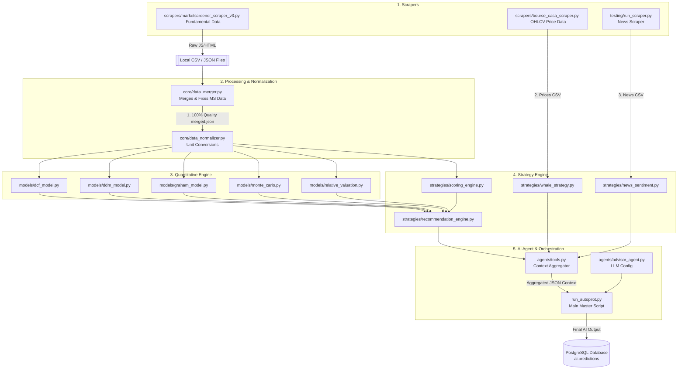

# PFE Trading System - Architecture Schema & Code Dictionary

This document maps out **every single moving part** of your AI Trading Advisory System. It shows how raw data from websites ultimately turns into an intelligent BUY/SELL recommendation by the AI agent.

## 1. Visual Schema (How Data Flows)

The following diagram illustrates how the different code files connect logic and data to one another.

---

## 2. Directory of Codes (What each file does & Why it's needed)

Here is a breakdown of every code file that has an active job in your project, categorized by phase.

### Phase 1: Data Collection (Scrapers)
These files fetch data from the outside world. Without them, the AI would be blind.

* **`scrapers/marketscreener_scraper_v3.py`**
  * **Function:** A heavily protected Selenium scraper using `undetected_chromedriver`. It bypasses Cloudflare to visit internal MarketScreener pages (Finances, Cash-flows, Valuations).
  * **Why it's needed:** This gives us access to 8-years of strictly categorized financial records (Revenue, EPS, Debt, Equity) necessary for performing intrinsic financial valuations.
* **`scrapers/bourse_casa_scraper.py`**
  * **Function:** Hits the official Bourse Casa web API to retrieve OHLCV (Open, High, Low, Close, Volume) daily trading histories.
  * **Why it's needed:** Enables the system to look at technical trends (SMA moving averages) and volume spikes over 3+ years. 
* **`testing/run_scraper.py` & `testing/scraper.py`**
  * **Function:** The News Scrapers. It quickly downloads headlines, dates, and links relative to the 80 stocks. 
  * **Why it's needed:** Tells the AI if a company currently has positive expansion news or is caught in a controversy.

### Phase 2: Core Data Engine (Cleaning)
Since web data is messy and fragmented, these scripts clean it up before feeding it to math formulas.

* **`core/data_merger.py`**
  * **Function:** Takes all the messy, broken, or half-complete JSONs generated by market screener scrapers, fixes edge-cases, and merges them into a single, high-quality, 100%-validated file (`*_merged.json`).
  * **Why it's needed:** If a math model receives "Null" or an error for Revenue, it crashes. The data merger guarantees output stability.
* **`core/data_normalizer.py`**
  * **Function:** Transposes values (e.g., converting mixed billions/thousands into a neat "Millions of MAD" format).
  * **Why it's needed:** Ensures that when the DCF model calculates the margin, they are using the same decimal unit.

### Phase 3: Mathematical Valuation Models
These simulate what a real Wall Street analyst mathematically calculates on an excel sheet.

* **`models/dcf_model.py`**
  * **Job:** Calculates Discounted Cash Flow. Uses future cash flow forecasts to figure out what a company is fundamentally worth today.
* **`models/ddm_model.py`**
  * **Job:** Dividend Discount Model. Prices the stock based solely on the dividends it pays out to shareholders.
* **`models/graham_model.py`**
  * **Job:** Uses Benjamin Graham's classic defensive formula matching EPS and standard growth against Corporate Bond yields.
* **`models/monte_carlo.py`**
  * **Job:** Runs hundreds of randomized simulations based on historical standard deviation to find probability-linked high/low risk scenarios.
* **`models/relative_valuation.py`**
  * **Job:** Industry comparison looking at standard P/E margins. 

### Phase 4: Scoring and Strategies
These files convert raw numbers into easily digestible "Scores" or "Signals".

* **`strategies/scoring_engine.py`**
  * **Function:** Analyzes the normalizer’s output and assigns a score out of 100 on 5 dimensions: Value, Quality, Growth, Safety, and Dividend.
  * **Why it's needed:** The AI understands a "Safety Score of 85/100" much better than it understands 10 lines of complex ratio decimals.
* **`strategies/recommendation_engine.py`**
  * **Function:** Averages out the 5 models above, weighting them based on whether a company is a dividend payer (weights DDM higher) or regular (weights DCF higher), and outputs a hard BUY/SELL/HOLD signal.
* **`strategies/whale_strategy.py`**
  * **Function:** Loops through the daily price CSVs looking for anomalous volume spikes (e.g. 5x the average volume).
  * **Why it's needed:** Identifies when institutional players (whales) are secretly buying massive chunks of shares.
* **`strategies/news_sentiment.py`**
  * **Function:** Uses a Natural Language keyword list to rate news headlines in the CSV as Positive, Neutral, or Negative. 

### Phase 5: The Brain (AI Interfacing)
These files bridge the gap between Python and the Groq LLM (llama-3).

* **`agents/tools.py`**
  * **Function:** The master contextual aggregator. When called, this script executes *every single file mentioned in Phases 2, 3, and 4*, bundles their reports up, and dumps them into a neat JSON dictionary context.
  * **Why it's needed:** The LLM does not inherently know how to run Python scripts or read 20 CSV files at once. `tools.py` acts as the LLM's hands and eyes, providing a single readable context object for it to consume.
* **`agents/advisor_agent.py`**
  * **Function:** Sets up the Agno configuration, providing Llama-3.3-70b with its system prompt ("You are a strict Moroccan Stock Broker..."). 
* **`run_autopilot.py`**
  * **Function:** The Master Orchestrator. 
  * **Job:** It loads the LLM (`advisor_agent`), asks it for an analysis by handing it data (`tools.py`), and then takes the response and saves it permanently to the PostgreSQL database for historical memory tracking. This is the script you put on a CronJob to automate the advisory.
